# WeMotions

To build and run the app on your device, do the following:

-   [Install Flutter](https://flutter.dev/docs/get-started/install/) by following the instructions on their website.
-   Fork/clone this repo to your computer using 

```bash
https://github.com/FlicLabs/wemotions-mobile-hiring.git
```

- Use Flutter **FVM** to setup project.
- Connect your devices/emulators and run the app using `flutter run` in the root of the project directory.


## Flutter Assignment: Implement 4D Scrolling

### Objective

Enhance the Wemotions mobile app by implementing a dynamic 4D scrolling experience that enables users to seamlessly browse video feeds and their video replies. The goal is to create an immersive and smooth scrolling interface where users can easily navigate through videos and their corresponding video replies.

### Reference Links

- **Nested Pagination Flowchart:**  
  


- **4D Scrolling Explanation Video:**  
  [](https://drive.google.com/file/d/1wc2NeQ3_Wu1yv_O_hec9HtkO-58G7HuQ/preview?usp=sharing)

- **App video demonstraction 👇:**  
  [](https://drive.google.com/file/d/1XwSfpa1iaNB5h28Km8KwwvHQ8No7QEa1/preview?usp=sharing)

### Tasks

#### 1. API Integration

- Use the following endpoints:

Fetch the list of main video feed. 
```bash 
https://api.wemotions.app/feed?page=1&page_size=5
```  
Fetch video replies linked to a specific video. 
```bash
https://api.wemotions.app/posts/{id}/replies?page=1&page_size=5
```

## Requirements:

  - Dynamically display video feeds from the API.
  - Implement lazy loading for video feeds and replies to optimize data usage and performance.

#### 2. 4D Scrolling Implementation

- Create a smooth, immersive 4D scrolling experience:

  - **Vertical Scrolling:** Navigate through the list of main video feed. 
  - **Nested Scrolling:** Allow vertical or horizontal scrolling through video replies under each main video.
  - **Video Interactivity:** Enable play/pause functionality for videos during scrolling and user interaction.

#### 3. Performance Optimization

- Ensure efficient rendering of both video feeds and replies to prevent lag or stutters.
- Apply lazy loading techniques to fetch video data only when necessary, reducing memory usage and network overhead.

#### 4. UI/UX Consistency

- Align all video elements with the app’s existing design and visual style.
- Clearly distinguish main videos from their replies and enable smooth transitions between them.

#### 5. Error Handling

- Gracefully handle API failures or cases where no video replies are available.
- Provide appropriate fallback UI or messages in such scenarios.

### 6. Dot (.) Indicators — What Do They Mean?


Each dot represents a **page of videos or replies** — think of them as “batches” of 5 videos each.

- The letter **“H”** means **Home** pointing the **main parent at home feed**.
- The letter **“P”** means **Parent** or the **parent video of current replies**.
- The **number inside the dots** shows how many more videos or replies are left to load beyond what you see now.
- A **filled dot** shows the **current video** being viewed.
- These dots help users see how much content there is and track where they are while browsing.

## Final Output 
- Final output should look simillar as shown in the video.
[final expected result](https://drive.google.com/file/d/1XwSfpa1iaNB5h28Km8KwwvHQ8No7QEa1/preview?usp=sharing)

### Video Graph

```mermaid
graph TD
    %% Root Videos (no parent)
    V208["208 - jack"]
    V211["211 - nidhi"] 
    V212["212 - neha"]
    V215["215 - mahek07"]
    V217["217 - alfi"]
    V218["218 - nidhi"]
    V220["220 - alfi"]
    V226["226 - ekta"]
    V235["235 - simran"]
    V236["236 - Anas"]
    V237["237 - alfi"]
    V240["240 - kinha"]
    V366["366 - grnyqvcnj8"]
    V368["368 - syd"]

    %% Level 1 Connections
    V211 --> V216["216 - alfi"]
    V212 --> V214["214 - mahek07"]
    V212 --> V225["225 - ekta"]
    V212 --> V227["227 - hemangi03"]
    V218 --> V219["219 - alfi"]
    V218 --> V224["224 - ekta"]
    V220 --> V221["221 - nidhi"]
    V220 --> V222["222 - mahek07"]
    V220 --> V223["223 - ekta"]
    V220 --> V228["228 - hemangi03"]
    V220 --> V370["370 - nidhi"]

    %% Level 2 Connections
    V214 --> V230["230 - hemangi03"]
    V224 --> V232["232 - hemangi03"]
    V227 --> V233["233 - neha"]

    %% Level 3 Connections
    V232 --> V369["369 - arshasss"]

    %% Styling for different users
    classDef userJack fill:#FF6B6B,stroke:#333,stroke-width:2px,color:#fff
    classDef userNidhi fill:#4ECDC4,stroke:#333,stroke-width:2px,color:#fff
    classDef userNeha fill:#45B7D1,stroke:#333,stroke-width:2px,color:#fff
    classDef userMahek fill:#96CEB4,stroke:#333,stroke-width:2px,color:#fff
    classDef userAlfi fill:#FECA57,stroke:#333,stroke-width:2px,color:#000
    classDef userEkta fill:#FF9FF3,stroke:#333,stroke-width:2px,color:#fff
    classDef userHemangi fill:#54A0FF,stroke:#333,stroke-width:2px,color:#fff
    classDef userSimran fill:#5F27CD,stroke:#333,stroke-width:2px,color:#fff
    classDef userAnas fill:#00D2D3,stroke:#333,stroke-width:2px,color:#fff
    classDef userKinha fill:#FF9F43,stroke:#333,stroke-width:2px,color:#fff
    classDef userGrny fill:#C44569,stroke:#333,stroke-width:2px,color:#fff
    classDef userSyd fill:#F8B500,stroke:#333,stroke-width:2px,color:#fff
    classDef userArshasss fill:#6C5CE7,stroke:#333,stroke-width:2px,color:#fff

    %% Apply styles
    class V208 userJack
    class V211,V218,V221,V370 userNidhi
    class V212,V233 userNeha
    class V214,V215,V222 userMahek
    class V216,V217,V219,V220,V237 userAlfi
    class V223,V224,V225,V226 userEkta
    class V227,V228,V230,V232 userHemangi
    class V235 userSimran
    class V236 userAnas
    class V240 userKinha
    class V366 userGrny
    class V368 userSyd
    class V369 userArshasss
```

### Submission Instructions

1. **GitHub Repository Link**
   Please share your GitHub repository link containing your implementation so our engineering team can review the code quality and overall solution.

2. **Introductory Video**  
   Submit a short video (around 30 seconds) introducing yourself to help our HR team to verify your profile.

3. **Demo Video**  
   Provide a 2-minute video demonstration of the app where you are playing with the 4D scrolling feature implemented by you, allowing our HR team to evaluate your submission before forwarding it to the technical team.

4. **Built APK**  
   Include the built APK file so our engineers can test the app and validate the implementation’s functionality.

### Evaluation Criteria

- **Functionality:** All assigned features work correctly without crashes or errors.  
- **Performance:** Scrolling is smooth, and video data loads efficiently.  
- **User Experience:** The app delivers an immersive, responsive, and intuitive navigation experience.  
- **Code Quality:** Code is clean, modular, well-documented, and [follows best practices](./BestPracticeToFollow.md).
